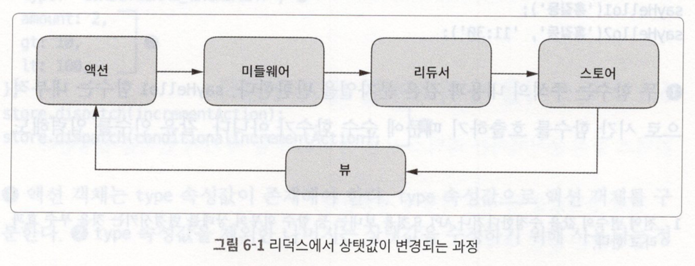

# React 정리

## React
* props는 속성을 나타내는 데이터이다.
* React가 사용자 정의 컴포넌트 발견 시 JSX어트리뷰트를 해당 컴포넌트에 단일 객체로 전달함. 이 객체를 'props'라고 한다.
* 컴포넌트 이름은 항상 대문자로 시작한다.
* 컴포넌트는 자신의 state를 자식 컴포넌트에 props로 전달할 수 있다.
* React의 이벤트는 소문자 대신 카멜케이스를 사용한다.
* React에선 false를 반환해도 기본 동작을 방지할 수 없다. 반드시 preventDefault를 명시적으로 호출해야 한다.
* Key는 어떤 항목을 변경, 추가, 삭제할지 식별하는 것을 돕는다. 

### React 탄생배경
* 상태가 바뀔 때 다 날려버리고, 처음부터 모든 걸 새로 만들어서 보여준다 로 시작
* 실제 DOM을 모두 다시 그리면 속도가 많이 느리기에, 가상DOM을 이용하여 가능케 함
* 가상DOM이란 메모리에 가상으로 존재하는 DOM으로, 그냥 자바스크립트 객체다. 상태 업데이트 시 비교알고리즘을 통해 변경된 곳을 감지 후 실제 DOM에 패치한다.

### 컴포넌트
* input, select, textarea와 같이 state를 거쳐 보여주는 값이 반영되는 컴포넌트를 Controlled Component라 부른다.

## Redux
리덕스(redux)는 자바스크립트를 위한 상태 관리 프레임워크이다.

### 사용하는 이유 or 장점  
1. 컴포넌트 코드로부터 상태 관리 코드를 분리할 수 있다.
2. 서버 렌더링 시 데이터 전달이 간편하다.
3. 로컬 스토리지에 데이터를 저장하고 불러오는 코드를 쉽게 작성할 수 있다.
4. 같은 상태값을 다수의 컴포넌트에서 필요로 할 때 좋다.
5. 부모 컴포넌트에서 깊은 곳에 있는 자식 컴포넌트에 상태값을 전달할 때 좋다.
6. 알림창과 같은 전역 컴포넌트의 상태값을 관리할 때 좋다.
7. 페이지가 전환되어도 데이터는 살아 있어야 할 때 좋다.

### 3가지 원칙  (설명은 아래)
1. 전체 상태값을 하나의 객체에 저장한다.
2. 상태 값은 불변 객체다.
3. 상태 값은 순수 함수에 의해서만 변경되어야 한다.

### 원칙 설명
- **하나의 객체에 전체 상태값을 저장한다.**  
  하나의 객체를 직렬화해서 서버와 클라이언트가 전체 상태값을 서로 주고 받을 수 있다.  
  최근 상태값을 저장 시 실행 취소(undo)와 다시 실행(redo)을 쉽게 구현할 수 있다.

- **상태값을 불변 객체(액션 객체)로 관리한다.**  
  리덕스의 상태값은 액션 객체와 dispatch 메서드를 호출하는 방법만 가능하다.  
  상태값은 dispatch 메서드가 호출된 순서대로 리덕스 내부에서 변경된다.  
  목적이 상태값 수정만이라면 상태값 직접 수정이 더 빠르지만,  
  이전 상태값과 비교하여 변경 여부를 파악할 땐 불변 객체가 훨씬 유리하다.  

- **순수 함수에 의해서만 상태값을 변경해야한다.**  
  리덕스에서 상태값을 변경하는 함수를 리듀서(reducer)라고 한다.  
  리듀서는 이전 상태값과 액션 객체를 입력받아 새로운 상태값을 만드는 순수 함수다.  
  > 순수 함수 : 외부의 상태를 변경하거나 인자의 상태를 직접 변경하는 부수 효과가 없는 함수  


### 주요 개념
상태값이 변경되는 과정은 아래와 같다. 
  
  
1. **액션**  
   액션은 type속성값을 가진 자바스크립트 객체다. dispatch 메서드에 넣어 호출 시  
   리덕스는 위 그림의 과정을 수행한다. 
   액션 객체는 type 속성외 다른 원하는 속성값도 넣을 수 있다.
   ```javascript
    store.dispatch({ type: 'REMOVE_ALL' });  
    store.dispatch({ type: 'REMOVE', id: 123 })
   ```  
   <br>

    각 액션은 고유한 type 속성값을 사용해야하며, 충돌을 피하기 위해 아래와 같이 접두사를 붙이는 방법을 많이 사용한다.  
    ```javascript
    store.dispatch({ type: 'todo/REMOVE' })
    ```

2. **리듀서**  
   리듀서는 액션이 발생했을 때 새로운 상태값을 만드는 함수다.
   작성 예는 아래와 같다.
   ```javascript
   function reducer(state = INIT_STATE, action) {
       switch (action.type) {
            case ADD: 
                return {
                    //...
                };
            case REMOVE: 
                return {
                    //...
                };
            default:
                return state;
       }
   }

   const INIT_STATE = { todos: [] };
   ```

3. **스토어**  
   스토어는 리덕스의 상태값을 갖는 객체다. 액션의 발생은 스토어의 dispatch 메서드로 시작된다.  
   스토어는 액션이 발생하면 미들웨어 함수를 실행하고, 리듀서를 실행해서 상태값을 새로운 값으로 변경한다.  
   그리고 사전에 등록된 모든 이벤트 처리 함수에게 액션의 처리가 끝났음을 알린다.  
<br>
--- 
<br>

## create-react-app
* create-react-app은 웹 어플리케이션을 만들기 위한 환경을 제공한다.  
* 바벨, 웹팩도 포함과 있으며, 테스트 시스템, HRM(hot-module-replacement), ES6+, CSS 후처리 등 거의 필수라고 할 수 있는 개발 환경도 구축해준다.
* index.html, index.js파일은 빌드 시 예약된 파일이므로 지우면 안된다.
* index.js로부터 연결된 모든 JS, CSS 파일은 src 폴더 밑에 있어야 한다.
  (src 폴더 바깥에 있는 파일 import 시 실패함)
* 이미지, 폰트 파일도 src폴더 밑에서 import 해야 브라우저 캐싱 효과를 볼 수 있다.
* npm run eject 선언 시 숨겨져 있던 내부 설정파일이 노출된다. (바벨, 웹팩 등의 설정을 변경할 수 있다.)

## Hook  
Hook은 함수 컴포넌트에서 state와 생명주기 기능을 '연동'할 수 있게 해주는 함수이다.

### Hook 2가지 원칙
* 최상위에서만 Hook 호출. 반복문, 조건문, 중첩된 함수 내에서 실행 X
* 리액트 함수 컴포넌트 내에서만 Hook 호출. (custom Hook내에선 가능)